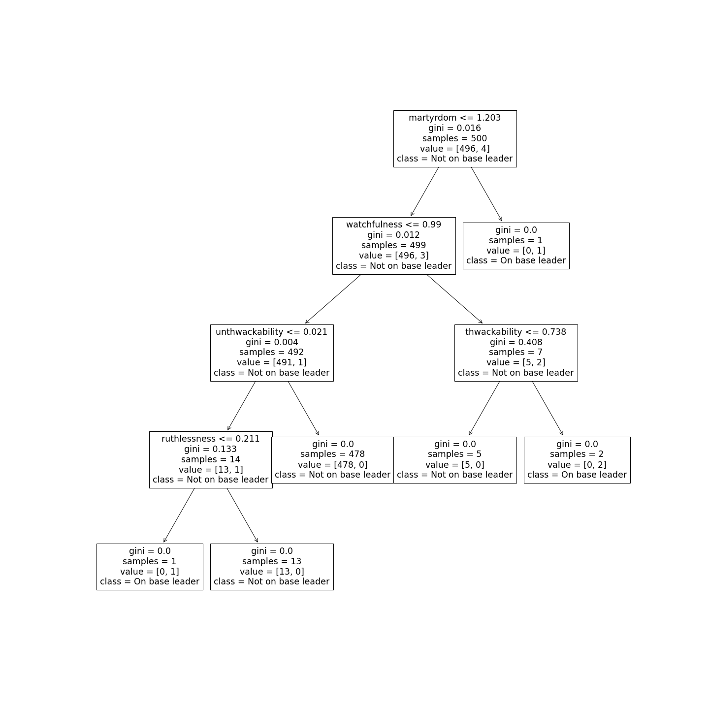
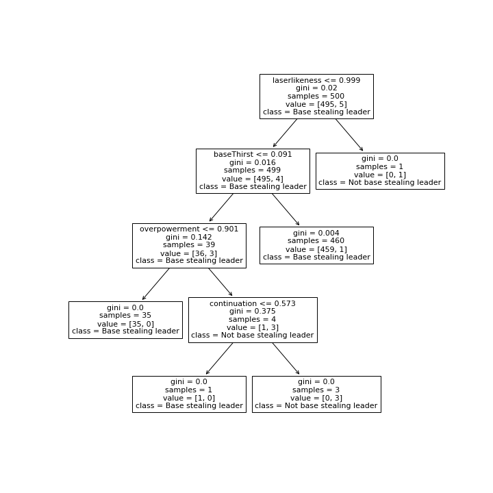
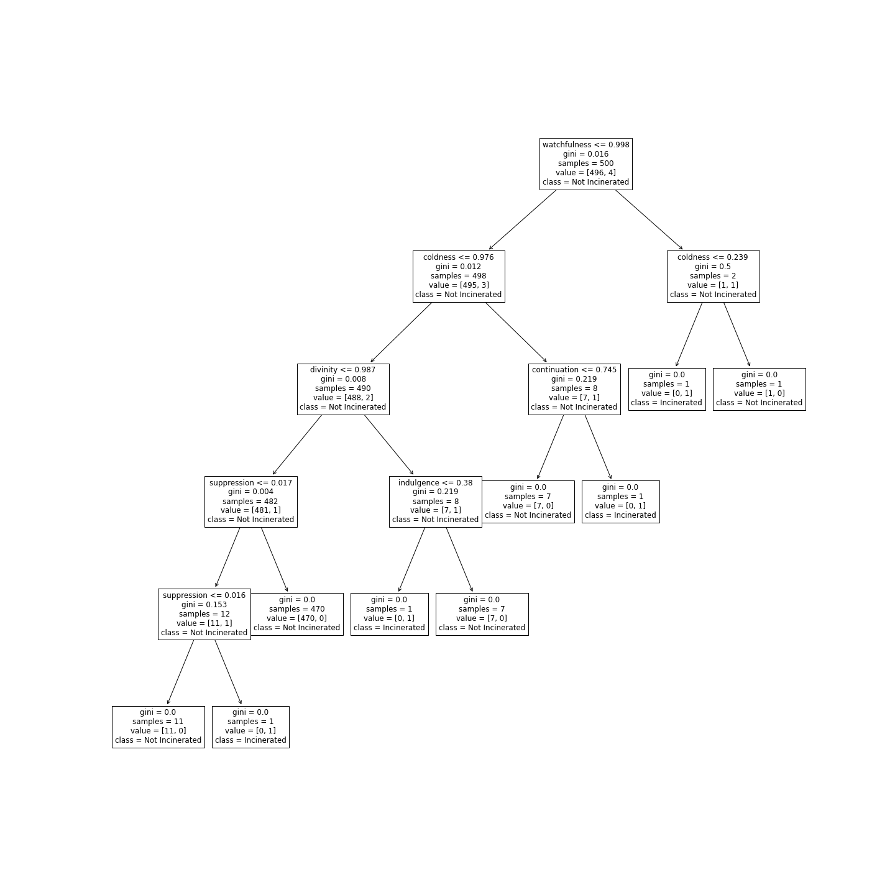

# Introduction

In the last week, large swathes of the Internet have been enamored with the simulated sport of [blaseball](https://www.blaseball.com). Blaseball describes itself as "baseball at your mercy, baseball perfected". I've been describing it as "Nightvale-esque simulated baseball with rules decided by a voting system". It's fun, that's for sure. Blaseball saw a boom after being picked up by a number of news outlets, and a number of blaseball users thought "now, this is fun, but I want to know it like I know myself". I was one of these users. Our goal is to divine the secrets of blaseball, and pierce the intentional occulting that the developers have constructed. The goal isn't to use this knowledge to win, or to bend the game to our will, but simply to understand. Enclosed within this 21st century letter I've documented a set of early findings based on what is most readily available to us. Some blaseball users would rather not peek behind this curtain, if you are among them, turn back now. If not, I implore you to continue onward, and then join our cause at [The Society for Internet Blaseball Research](https://discord.gg/JF3g7A).

# Forbidden Knowledge

## Statistics

One of the first things that was discovered was the table of player statistics. On each team roster, you can see star ratings which ostensibly compare players' skill to one another. These are determined by the *hidden statistics*, but not by all of them. The full list of statistics, organized by inclusion in the star ratings is below. Stats that don't contribute are marked "X", stats that contribute positively are marked "+", and those that contribute negatively are marked "-".

|Statistic|Contributes to Pitcher Stars|Contributes to Batter Stars|
|---------|----------------------------|---------------------------|
|`anticaptitalism`|X|X|
|`baseThirst`|X|X|
|`buoyancy`|X|X|
|`chasiness`|X|X|
|`coldness`|+|X|
|`continuation`|X|X|
|`divinity`|X|+|
|`groundFriction`|X|X|
|`indulgence`|X|X|
|`laserlikeness`|X|X|
|`martyrdom`|X|+|
|`moxie`|X|+|
|`musclitude`|X|+|
|`omniscience`|X|X|
|`overpowerment`|+|X|
|`patheticism`|X|-|
|`ruthlessness`|+|X|
|`shakespearianism`|+|X|
|`suppression`|X|X|
|`tenaciousness`|X|X|
|`thwackability`|X|+|
|`tragicness`|X|-|
|`unthwackability`|+|X|
|`watchfulness`|X|X|
|`pressurization`|X|X|
|`totalFingers`|X|X|
|`soul`|X|X|

A large number of these hidden statistics do not show up in the star rating. Clearly there's more going on behind the scenes. In a way this makes sense, the star rating has no bearing on simulation, it's just there to give users an idea of who is good, and who is not. A full description of how the star ratings can be found [here](files/blaseblaseball.pdf), courtesy of @baronbliss. 

This is incredibly useful in our uncovering of blaseball's core simulation. It gives us an idea of which stats most visibly effect a batter or pitcher's ability as advertized. The problem is, baseball ability in general is split up into a number of areas. Some pitchers are known for killer fastballs, some for tricky curves, some for faking out batters with balls. Some batters are known for running fast, and others are sluggers. Furthermore, this tells us very little about the player's fielding ability, and that's almost half of the game!

## The Ticker

The blaseball interface tells us only a few things about the game. There's a live play-by-play for each game running constantly, and a news events ticker. While the ticker mostly delivers us lore and jokes, it occasionally tells us season statistics leaders, translated into real baseball statistics. Let's see what we can get out of that.

Because the ticker is live, I was only able to capture a few statistics. These are bases stolen, on base percentage, and batting average. In addition, each statistic only tells us the five top players. This gives us a bit of a disadvantage. We can't just do a regression against the statistics to figure out where they come from, because we only have 5 data points. What we can do though, is train a model to detect whether or not a player is a leader in that category. This effectively tells us what statistics the leaders have in common.

It's worth pointing out that this analysis is based off of the ticker statistics as of Thursday, July 30th. Season 2, Day 75 roughly. This is because the game came under heavy load around that time, and afterwards was displaying ticker statistics that made it seem like the real statistics were lost to history. This loss of data is a tragedy to the SIBR community, and the other developers are hard at work to ensure that a backup of the game data exists in perpetuity.

### The Model

For this I'm going to use a decision tree classifier. These are generally preferred for situations where we want to be able to interpret the results of the classification. The negative to this being that decision trees are very easily tricked by spurious connections. We need to be careful as to which parts we take seriously and which parts we throw out. I will explain each of these decisions as we go along.

Generally speaking, the way this model works is the computer takes a large dataset, with a large number of characteristics for each data point, and tries to find a dividing line that separates the data points which are marked True from the points which are marked false. It does this on each statistic one at a time, and keeps going until it has them all correct. It essentially creates a large flow chart of if statements. For example, if `watchfulness` is below .9, then go left, else go right, etc. Then when this tree is done, the algorithm goes back and scores each branch by how much it contributes to the final product, removing all those that contribute below a certain threshold. (If you're interested in how it scores each branch, you can look up "gini impurity"). In the end, we're left with the simplest possible decision tree that gets the most classifications correct. This backwards process is called "pruning".

### Batting Average

Here is the result for the batting average:

NOTE: This chart is labeled poorly, and I noticed it after the statistics became broken, so it can't be easily fixed. The classes appear to be backwards. The branches labeled "Not batting leader" are the success branches. This chart shows how the classification is RULED OUT.

This chart can be a little arcane, so I'll give an explanation of how to read it. At the top of each branch, there's a conditional statement. If a player satisfies that condition, they go left, if not, they go right. At the `martyrdom` stage, this tells us that only one player has a `martyrdom` score higher than 1.203. At the `baseThirst` stage, it tells us that of the players remaining, 4 of them have a `baseThirst` above 0.989. Of which, one is classified as a batting average leader.

Starting from the top, we see `martyrdom`, then `baseThirst`, then `divinity`. Knowing that however, the `martyrdom` and `divinity` branch only split off one player each, and `martyrdom`'s condition is extremely difficult to not satisfy. This implies that the `baseThirst` branch is the most important. As such, we've deduced that `baseThirst` is related to whether or not a player is a batting average leader. `divinity` may be relevant. It only branches off one player, but the condition is not an extremely high score. It also has a large gini impurity, which tells us that there's a very high likelihood that a random input to that branch would be incorrectly labeled if you just guessed based on the known distribution of labels. The branches that the `divinity` branch feeds into have 0 gini impurity, so the `divinity` branch is doing a lot of work, even though it only filters out one player.

### On Base Percentage

Here is the result for On Base Percentage, this chart is labeled more sensibly.

This one is a bit more complicated. This is because the accuracy of this model dropped quickly when the pruning operation was allowed a higher criteria. Again, the player with very high `martyrdom` drops out immediately. I believe this is likely a coincidence. `watchfulness` shows up next, filtering out 7 players. This is useful information, and likely means that `watchfulness` is a secondary batting characteristic. Then we see `thwackability`. `thwackability` filters out two players, at a very high gini impurity node. This seems to back up the star ratings' assertion that `thwackability` is a high batter statistic. Then we see `unthwackability`. It filters out a lot of players, so it's hard to ignore. `unthwackability`, according to this analysis, is important to on base percentage, perhaps it is relevant to whether or not a player gets tagged out? `ruthlessness` is up next, and filters out one player inversely. We can probably write this off, but maybe not. Something to look into in the future.

### Stolen Bases

Here is the result for stolen bases, again using the counterintuitive labeling.

Again, we see `baseThirst`, but with a __low__ `baseThirst` correlating with base stealing leads. This is extremely counter-intuitive. One player with very high `laserlikeness` is filtered out quickly, perhaps `laserlikeness` has the tendency to overpower other statistics? `overpowerment` is next. This is a real meat-and-potatoes branch. With a high gini impurity going in, and filtering out a good amount of players, we see that having a low `overpowerment` makes you much less likely to lead the league in bases stolen. Finally, `continuation`. 

### Incineration

Incineration is a metagame mechanic, where a rogue umpire decides that a player no longer should be playing, and incinerates them on the spot. According to the ticker, "Incineration is the only way out." Let's see if there are any player statistics correlated with incineration. (Note, even though more players have been reported incinerated than have been season league statistic leaders, deceased players statistics are removed from the api, so we have about as much data on them as we do on league leaders at this juncture.)

Here's the chart, this has intuitive labels.

Yikes that's complicated. Right away though we can ignore the `suppression` branches, those two only filter out one person together, and don't contribute very highly to the gini impurity. Above that though `divinity`, `coldness`, and `watchfulness` catch the eye. Two players fail the `watchfulness` test, and one of them is incinerated, so that might not be super useful information for now. Then see `coldness`, of the players incinerated, two have low `coldness`. Altogether though, this entire tree is filled with very rare conditions and lower splits that don't tell us much. It seems that for now, incineration is still a mystery. Just to be safe though, I'm going to continue praying to the blaseball gods. What little evidence we have seems to suggest that having a high divinity may increase your chance of incineration.

## Conclusion

We got a lot from a little here. We've only just scratched the surface though. From this investigation I feel comfortable saying two things for sure, `baseThirst` leads to high batting averages, and `thwackability` and `unthwackability` are the most important things to look at in the batter's box. Stay tuned for more, and if you're interested in helping in the search, check out the Society for Internet Blaseball Research.