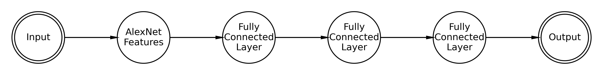

 
Memnet[^1] was an attempt to build a neural network based model to predict the memorability of an image. This attempt was carried out by Aditya Khosla at the Computer Science and Artificial Intelligence Labs at MIT, to moderate success. It is the most commonly used neural network regression for this purpose, and has been used and cited in a number of research papers since publication. There are some problems however. Memnet was built in Caffe, a deep learning framework which has been defunct since shortly after Memnet's publication. Memnet was trained on LaMem, a dataset to which public access has been restricted, and the original author, Aditya Khosla, is difficult to get a hold of. For the past couple of months I, under the auspices of the Brain Bridge Lab at the University of Chicago, have been investigating the model itself, as well as making some tweaks to utilize newer techniques and hardware access to solve the same problem.

## The Old Model

First things first, load up the Caffe model. This is easier said than done. For one, Caffe was designed fo 32 bit systems, and the rest of the computing community has looking forward, dropping 32 bit support. I don't need to get into exactly what was necessary to get caffe to run on a modern system here, but in short, be prepared to cut features out in the makefile. 

For the reader who is more familiar with machine learning than psychology, the numbers reported in this discussion might seem strange. Although Memorability *is* a number between 0 and 1, it is still ultimately a relative value. Because of this, most papers about predicting memorability scores do not report Euclidean loss, but instead report Spearman Rank Correlation. This is done by ranking each value in two lists, and then measuring the Pearson or Standard Correlation between the ranks.

Testing the version of MemNet available on Khosla's website yields a Spearman rank correlation of about 0.565, which is within expected limits of the 0.57 reported in the paper.

## The New Old Model

Let's take a swing at modernizing MemNet. Running a Caffe Model downloaded from the Internet is largely plug-and-play. We don't need any knowledge of the model's architecture or anything to get it to work, it's just a function that takes in a photo and outputs a number. To rebuild the thing in PyTorch, however, we may need to put some thought in.

<em>Figure 1:</em> A skeleton diagram of the layer-structure of MemNet. It's designed to mimic the hugely successful image classifier AlexNet, which consisted of a few convolutional layers followed by 3 fully connected layers. In reality, the convolutional features of MemNet differ slightly from that of AlexNet. 

We need to reconstruct this from what can be gleaned from the `.caffemodel` that is provided on Khosla's website. For brevity, I won't write up the code here, but I will post it in an [appendix](https://www.coeneedell.com/appendix/memnet_extras/).

## Bibliography

[^1]: https://people.csail.mit.edu/khosla/papers/iccv2015_khosla.pdf