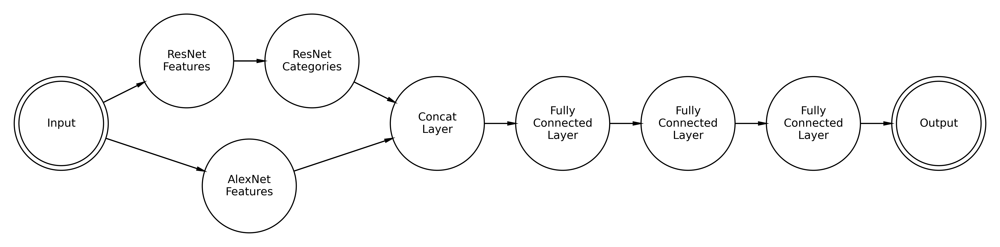

A user-ready version of ResMem is now available on PyPI! The model included in the package is designed to estimate the memorability of an input image but is not intended for feature space analysis. The model is optimized for accuracy by allowing the ResNet features to retrain. The model included in the `resmem` package has been dubbed "ResMemRetrain" for this reason. Statistically, the retrained model performs better than the model where ResNet is as-is, receiving a Spearman rank correlation of 0.64 on a held-out sample from both LaMem and MemCat.

ResMem is a deep learning model built in PyTorch for estimating the memorability of an image. It uses the classic image classification architecture ResNet as a feature space, as well as a Convolutional Neural Network feature space based on AlexNet. Then, using a series of linear transformations estimations of memorability are generated from these features.

